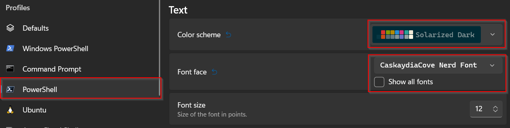

# 🎨 PowerShell Profile (Pretty PowerShell)

A stylish and functional PowerShell profile that looks and feels almost as good as a Linux terminal.

## Prerequisites

1. Install `Windows Terminal` via Powershell using the below code.  (If you don't have winget you can install it via the Microsoft store.)
    ```
    winget install Microsoft.WindowsTerminal
    ```

2. Install `Powershell 7.x` via Powershell using the below code. (If you don't have winget you can install it via the Microsoft store.)
   ```
   winget install Microsoft.Powershell
   ```

3. Close `Powershell`.  From now on we will be using `Terminal`.
4. Open `Terminal` and open a `PowerShell` tab if it doesn't open one automatically.
5. Go to `Settings` -> `Powershell` -> `Run this profile as Administrator` -> `On`
6. Close the settings and continue with the installation below.

## ⚡ One Line Install (Elevated PowerShell Recommended)

Open a new `Powershell` tab to execute the following command in an elevated PowerShell window to install the PowerShell profile:

```
irm "https://raw.githubusercontent.com/joeandronyk/powershell-profile/main/setup.ps1" | iex
```

## Set the Color Scheme and Font

Go to `Settings` -> `PowerShell` -> `Appearance` and change the `Color scheme` and `Font face`.



Now, enjoy your enhanced and stylish PowerShell experience! 🚀


## Un-Installation

```
winget uninstall JanDeDobbeleer.OhMyPosh
winget uninstall Microsoft.Powershell
winget uninstall Microsoft.WindowsTerminal
```